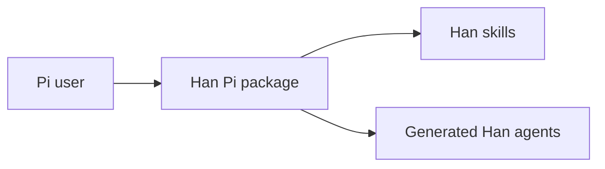

# Pi Compatibility Smoke Test Stakeholder Summary

## What changes for users

Han can be loaded from Pi as a package. The package exposes Han skills, installs generated Han agents for Pi-subagents, and gives Pi enough compatibility guidance to translate Claude Code-specific instructions.

## What is intentionally not in this slice

This smoke test does not validate every Han workflow. It checks that a simple report can be converted to HTML and that script path handling works in Pi.

## Mermaid overview

## Feedback requested

Confirm that the HTML report renders the text and diagram without needing Claude Code-specific environment variables.
